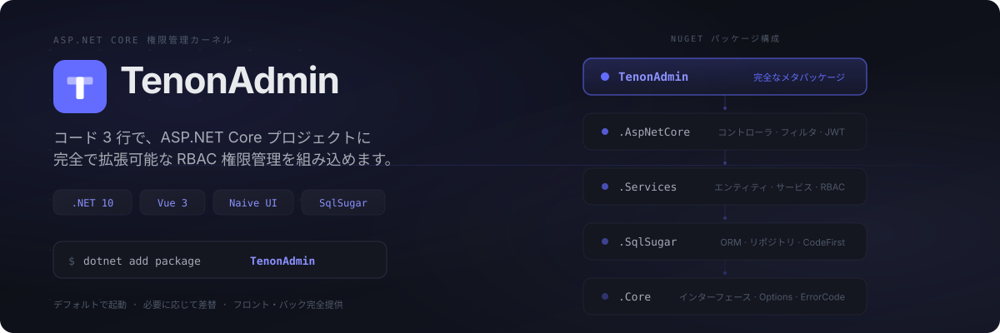

<!-- README.zh-CN.md（正本）に合わせて同期してください -->

[English](README.md) | [简体中文](README.zh-CN.md) | 日本語

<p align="center">
  
</p>

<p align="center">
  <a href="LICENSE"></a>
  <a href="https://github.com/Tenon-Net/TenonAdmin/stargazers"></a>
  <a href="https://github.com/Tenon-Net/TenonAdmin/network/members"></a>
  <a href="https://www.nuget.org/packages/TenonAdmin"></a>
  
  <a href="https://github.com/Tenon-Net/TenonAdmin/actions"></a>
</p>

<p align="center">
  <a href="https://tenonadmin.52moyu.net/login"><strong>🔗 オンラインデモ</strong></a>&nbsp;&nbsp;·&nbsp;&nbsp;<a href="https://tenon.52moyu.net"><strong>📖 ドキュメント</strong></a>&nbsp;&nbsp;·&nbsp;&nbsp;<a href="CHANGELOG.md"><strong>📋 更新履歴</strong></a>
</p>

---

TenonAdmin はコピーして二次開発する管理画面テンプレートではありません。ユーザー・ロール・メニュー・データ権限・ログなどの共通機能を NuGet パッケージとして提供し、既存プロジェクトにコード 3 行で組み込めます。デフォルトで動作し、必要に応じて差し替え可能です。

<p align="center">
  
</p>

NuGet パッケージをインストール：

```bash
dotnet add package TenonAdmin
```

またはリポジトリ同梱のサンプルを実行：

```bash
dotnet run --project backend/samples/MinimalHost
```

初回起動時にデータベースを作成し初期データを投入、ランダム生成された管理者パスワードをコンソールに出力します。

既存プロジェクトへの導入はわずか 3 行：

```csharp
builder.Services.AddTenonAdmin(builder.Configuration);
var app = builder.Build();
app.MapTenonAdmin();
```

起動後、JWT 認証・RBAC 権限・データ権限・全管理エンドポイントが自動的に登録されます。

<p align="center">
  
</p>

### バックエンド

- **認証** — アカウント/パスワード + キャプチャ、JWT + リフレッシュトークンローテーション、ログインロックアウト、オンラインセッションと強制ログアウト
- **RBAC** — ロール管理、ディレクトリ／ページ／ボタンの 3 階層メニュー、ボタンレベル権限コード、ロール-メニュー認可
- **データ権限** — 全データ / 自組織 / 自組織+配下 / 本人のみ / カスタム、ORM グローバルフィルタで自動適用
- **マルチアプリポータル** — アプリ管理、独立メニューツリー、アプリ選択と切り替え
- **組織** — 組織ツリー、役職、複数ロール対応ユーザーと主所属組織
- **通知** — アプリ内通知・お知らせ、全体 / ロール / ユーザー指定で送信
- **辞書と設定** — 辞書タイプ + 項目 + キーバリュー設定、キャッシュとイベント駆動キャッシュ無効化
- **ログ** — 操作ログ自動記録、機密入力マスキング
- **ファイル管理** — アップロード/ダウンロード、サイズ制限、拡張子ホワイトリスト、パストラバーサル防御
- **差し替え可能** — `TryAdd` + インターフェース + `virtual` ステップで登録、フォークなしで置換
- **マルチデータベース** — SQLite（デフォルト）/ MySQL / SQL Server / PostgreSQL
- **マルチレプリカ** — オプション Redis キャッシュ、レプリカ間レート制限カウンタ共有、レプリカごとの Snowflake ワーカー ID

### フロントエンド

- **契約生成 API** — OpenAPI → `schema.d.ts`、エンドツーエンドの型安全
- **動的ルーティング** — バックエンドのメニューツリーがルート登録を駆動、マルチアプリポータルのシームレス切り替え
- **ボタンレベル権限** — `v-auth` ディレクティブでルートベースの権限コードによりボタンの表示/非表示を制御
- **ProTable（列駆動）** — 1 つの `columns` 配列で検索フォーム・辞書レンダリング・列設定を同時に駆動
- **デザイントークン体系** — 4 層の CSS 変数トークン、ライト/ダーク両テーマ対等（システム追従 / 手動切替）
- **i18n** — vue-i18n でランタイム言語切り替え
- **3 種のログインページスキン** — すぐに使える切り替え式、スタイル分離
- **自社開発コンポーネント** — FormContainer（モーダル/ドロワー統合）、StatusSwitch（悲観更新トグル）、辞書スイート、OrgTreeSelect、FileUpload（チャンク/リジューム/即時アップロード）、PasswordStrength、ECharts ラッパーなど

## プロジェクト状況

**1.0 までに API が変わる可能性があります** — 破壊的変更は[更新履歴](CHANGELOG.md)に明記します。開発は `dev` ブランチで行っています。

## ライセンス

[Apache License 2.0](LICENSE)
