<!-- 本文件与中文基准版 README.zh-CN.md 保持同步 -->

[English](README.md) | [简体中文](README.zh-CN.md) | 日本語

<p align="center">
  
</p>

<h1 align="center">TenonAdmin</h1>

<p align="center"><strong>3 行のコードで、ASP.NET Core プロジェクトに RBAC とデータ権限を備えた管理画面フレームワークを導入します。</strong></p>

<p align="center">NuGet による導入 · サービスの差し替えと業務拡張 · Vue / React の 2 種類のフロントエンド</p>

<p align="center">
  <a href="https://www.nuget.org/packages/TenonAdmin"></a>
  
  <a href="https://github.com/Tenon-Net/TenonAdmin/actions/workflows/backend-ci.yml"></a>
  <a href="LICENSE"></a>
</p>

<p align="center">
  <a href="#クイックスタート"><strong>クイックスタート</strong></a> ·
  <a href="https://tenonadmin.52moyu.net/login"><strong>オンラインデモ</strong></a> ·
  <a href="https://tenon.52moyu.net/"><strong>ドキュメント</strong></a>
</p>

## フレームワーク概要

TenonAdmin は ASP.NET Core 向けの管理画面フレームワークです。ユーザー、ロール、メニュー、組織のデータ権限、辞書、設定、操作ログ、ファイル管理を NuGet パッケージとして提供し、管理画面には Vue と React の 2 種類のテンプレートを用意しています。

`TenonAdmin` パッケージをインストールし、`Program.cs` でサービスとエンドポイントを登録します。

```csharp
builder.Services.AddTenonAdmin(builder.Configuration);
var app = builder.Build();
app.MapTenonAdmin();
```

フレームワークは管理機能を担当し、アプリケーションプロジェクトは業務エンティティ、サービス、画面を持ちます。インターフェースによるサービスの差し替えや、組み込みサービスの継承による処理ステップの変更に対応します。フレームワークの更新は NuGet のバージョンとして配布し、互換性に関する変更は更新履歴に記載します。

- **SQLite で開始**：初回起動時にデータベースとテーブルを作成し、シードデータを読み込みます。
- **サービスのカスタマイズ**：依存性注入と `virtual` メソッドにより、サービスまたは処理ステップを差し替えます。カスタマイズしたコードはアプリケーションプロジェクトに置きます。
- **パッケージの更新**：修正と機能は NuGet から取得し、互換性に関する変更は更新履歴に従って対応します。
- **フロントエンドテンプレート**：Vue 3 + Naive UI または React 19 + Ant Design 6 を選び、付属のテーブル、フォーム、権限コンポーネントで業務画面を開発します。

## クイックスタート

バックエンドには .NET 10 SDK、フロントエンドには Node.js 22.12+ が必要です。

### 既存プロジェクトへの導入

ASP.NET Core プロジェクトのディレクトリでフレームワークをインストールします。

```bash
dotnet add package TenonAdmin
```

上記のサービス登録とエンドポイントのマッピングを `Program.cs` に追加し、プロジェクト側のアプリケーション作成処理と起動処理は残します。JWT 認証、RBAC、データ権限、管理 API はフレームワークが登録します。

データベース設定と導入手順は[導入ガイド](https://tenon.52moyu.net/guide/getting-started)を参照してください。新規プロジェクトでは、ガイドに記載された `dotnet new tenon-app` テンプレートでバックエンドホストを作成できます。

### サンプル一式を実行

リポジトリをクローンしてバックエンドを起動します。

```bash
git clone https://github.com/Tenon-Net/TenonAdmin.git
cd TenonAdmin
dotnet run --project backend/samples/MinimalHost
```

バックエンドの URL は http://localhost:5100 です。サンプルは SQLite を使用し、初回起動時にデータベースとテーブルを作成してシードデータを読み込み、`superAdmin` のランダムなパスワードをコンソールに表示します。

別のターミナルを開き、リポジトリのルートから使用するフロントエンドを起動します。

**Vue** — http://localhost:5173

```bash
cd web
npm install
npm run dev
```

**React** — http://localhost:5174

```bash
cd web-react
npm install
npm run dev
```

`superAdmin` とコンソールに表示されたパスワードでログインします。Windows では、ルートディレクトリの `dev.bat` を実行すると、バックエンドと 2 種類のフロントエンドが起動します。

## 設計と機能

### サービスを差し替え、業務を拡張

パスワードハッシュやファイルストレージなどのサービスはインターフェースを介して提供します。独自実装を `AddTenonAdmin` より前に登録すると、その実装を使用します。処理ステップを変更する場合は、組み込みサービスを継承し、該当する `virtual` メソッドをオーバーライドします。

サービス実装はアプリケーションプロジェクトに置き、フレームワークのコードは NuGet パッケージで管理します。サービスの差し替え、業務エンティティの検出、コントローラーの検出は契約テストで確認しています。[サービス差し替えの例](skills/replace-service.md)を参照してください。

### API 認可とデータ範囲

同じ顧客一覧にアクセスしても、クエリ結果はロールに設定されたデータ範囲によって変わります。業務エンティティが `IOrgScoped` を実装するか `DataEntity` を継承すると、SqlSugar のグローバルフィルターがクエリに組織条件を追加します。業務サービスがクエリを定義し、フレームワークがデータ範囲を適用します。

メニュー、ボタン、バックエンド API では、HTTP メソッドとルートを組み合わせた権限コードを使用します。API のアクセス権限は操作の可否を制御し、データ範囲はユーザーが参照できる業務レコードを制御します。

### Vue と React から選ぶ

Vue テンプレートは Vue 3 と Naive UI、React テンプレートは React 19 と Ant Design 6 を使用します。それぞれが依存関係、ルート、状態、コンポーネントを持ち、同じバックエンド API に接続します。

API 型は OpenAPI から生成します。業務画面では、検索テーブル、フォーム、辞書、組織とユーザーの選択、ファイルアップロード、インポートウィザードなどのコンポーネントを利用できます。

### 承認ワークフロー

フロー設計画面で承認ステップ、条件分岐、並列分岐、CC を設定し、動的フォームとステップごとの項目権限を定義します。承認画面は、開始、承認待ち、処理済み、差し戻し、取り消し、転送、委任、承認者の追加と削除、督促に対応します。

実行記録には承認履歴、タイムアウト時の処理、実行の再試行情報が含まれます。AI 判断の評価は OpenAI 互換のモデルサービスに対応し、結果を承認時の参考情報と監査記録に使用します。承認結果とフローの進行は承認ワークフローが制御します。

### 外部システム連携

公開 API では、呼び出し元のアプリケーション資格情報、API 権限、業務データ範囲を管理します。外部呼び出しでは、接続先 URL、資格情報、呼び出し記録を管理します。

配信を保証する必要がある業務では、業務データと配信レコードを同じデータベーストランザクションでコミットし、バックグラウンドで送信できます。後続処理では、受信側の冪等性と結果照会への対応に応じて、再試行、結果照会、手動確認を選択し、各試行を記録します。

### Vibe Coding：プロジェクト規約に沿って業務コードを書く

リポジトリには、エンティティ、CRUD、サービスの差し替え、定期ジョブ、インポートとエクスポート、システム連携などの[開発スキル](skills/README.md)があり、作業手順、コードの参照先、検証要件を定義しています。

AI アシスタントは、プロジェクトのエンティティ基底クラス、サービスインターフェース、権限規則、フロントエンドコンポーネントに従って業務モジュールを生成します。業務規則と生成結果は開発者が確認します。

## 機能一覧

| 分類 | 機能 |
| --- | --- |
| 認証とセッション | アカウントとパスワード、画像 CAPTCHA、JWT とリフレッシュトークンのローテーション、オンラインセッション、強制ログアウト。Cookie セッション、SMS ログイン、外部ログインは設定により導入 |
| 認証セキュリティ | ログインロック、リクエストのレート制限、TOTP、リカバリーコード、アカウント MFA ポリシー、機密性の高い操作での本人確認 |
| 権限と組織 | ロール、メニュー、ボタン権限、組織ツリー、役職。全データ、自組織、自組織と配下、本人のみ、指定組織の 5 種類のデータ範囲 |
| 管理機能 | マルチアプリポータル、辞書、設定、通知、SignalR メッセージ配信、操作ログ、機密入力のマスキング、監査フィールド、ゴミ箱 |
| ファイルと Excel | アップロード、ダウンロード、署名付きアクセス、分割アップロード、再開、同一ファイルの即時アップロード。インポートテンプレート、データプレビュー、セル検証、重複チェック、エラーレポート、エクスポート列の選択 |
| 承認ワークフロー | フロー設計、動的フォーム、ステップごとの項目権限、承認処理、タイムアウト時の処理、Webhook、実行監視、AI 判断の評価 |
| システム連携 | アプリケーション資格情報、公開 API の権限、業務データ範囲、アプリケーション単位のレート制限、外部呼び出し、トランザクション内の配信レコード、処理ログ |
| 定期ジョブ | 6 フィールド cron、固定間隔、1 回限りの実行。コード、HTTP、SQL ジョブ。SQL 実行は設定による有効化が必要。タイムアウト、再試行、ログ、失敗アラート、独立 Worker |
| フロントエンドテンプレート | Vue 3 + Naive UI、React 19 + Ant Design 6。中国語と英語、ライトとダークのテーマ、レイアウト設定、業務コンポーネント、OpenAPI 型生成 |
| データとデプロイ | SQLite、MySQL、SQL Server、PostgreSQL。CodeFirst、複数データベース接続、Redis 共有キャッシュ、データベースリース、複数レプリカ構成、Docker、ヘルスチェック |
| 開発ツール | バックエンドプロジェクトテンプレート、AI 開発スキル。Vue ProTable と IconPicker の独立 npm パッケージ |

## 画面プレビュー

<table>
  <tr>
    <td width="50%" align="center"><a href="docs/screenshots/vue-admin.png">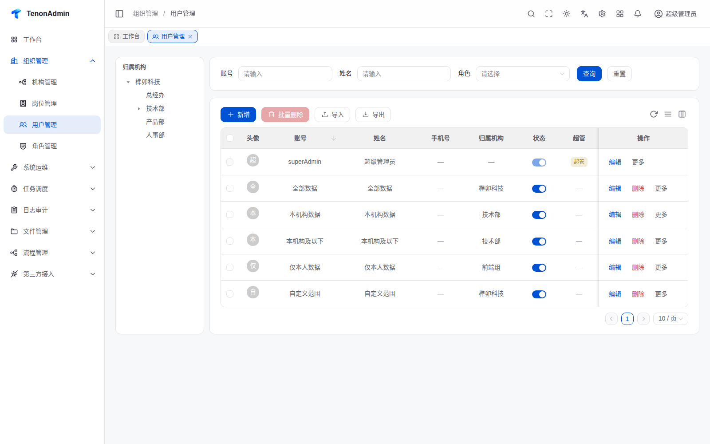</a><br>Vue ユーザー管理</td>
    <td width="50%" align="center"><a href="docs/screenshots/react-admin.png">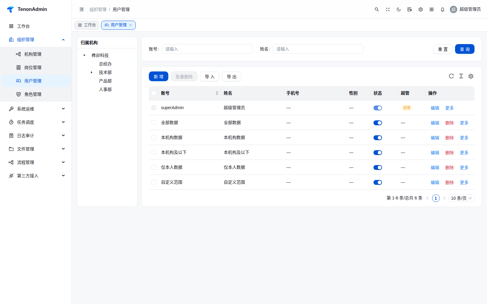</a><br>React ユーザー管理</td>
  </tr>
  <tr>
    <td width="50%" align="center"><a href="docs/screenshots/workflow-designer.png">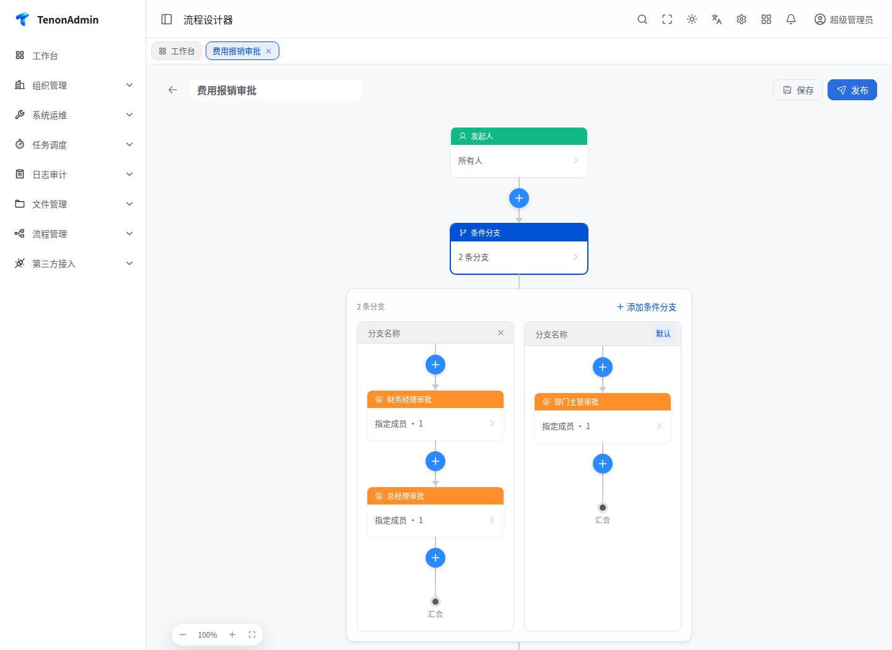</a><br>フロー設計</td>
    <td width="50%" align="center"><a href="docs/screenshots/workflow-approval.png">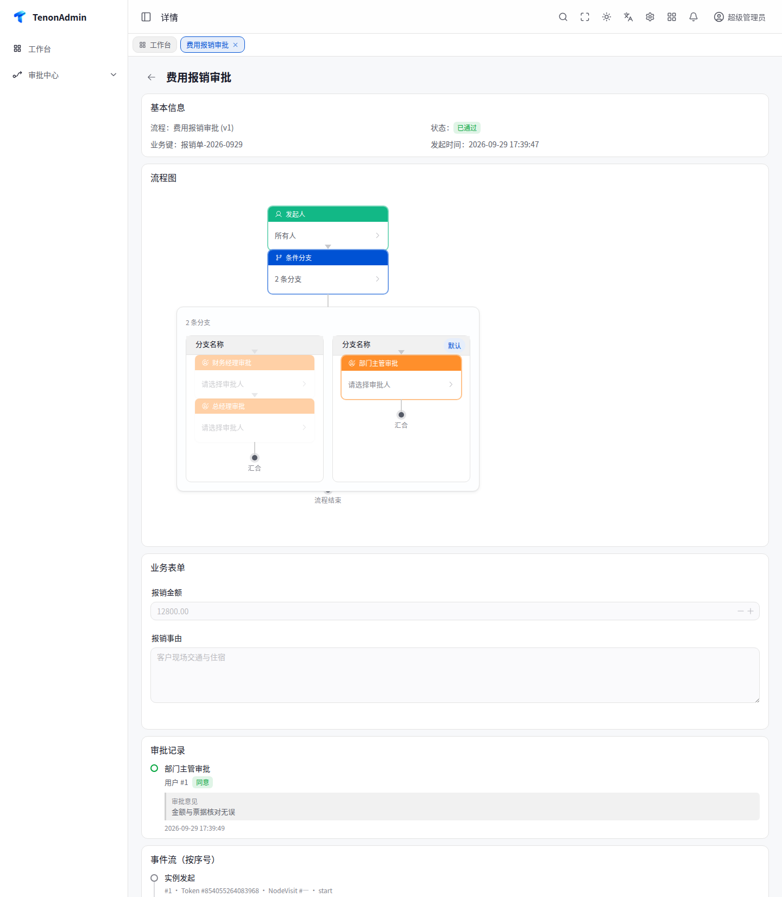</a><br>承認詳細</td>
  </tr>
  <tr>
    <td width="50%" align="center"><a href="docs/screenshots/role-permissions.png">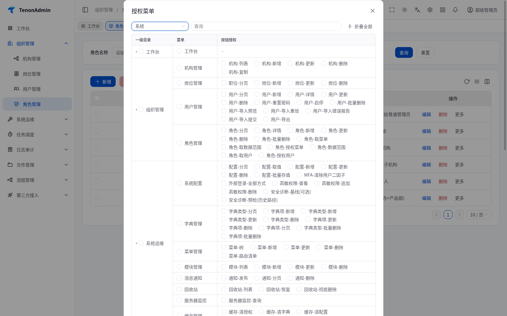</a><br>ロール権限</td>
    <td width="50%" align="center"><a href="docs/screenshots/integration-apps.png">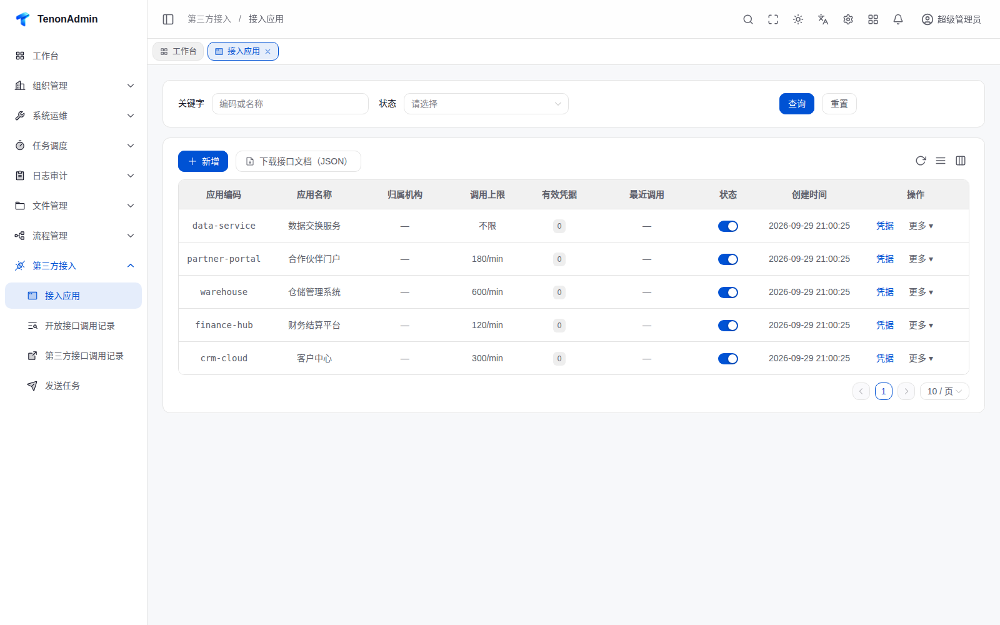</a><br>連携アプリ</td>
  </tr>
</table>

<details>
<summary>その他の画面を見る</summary>

<table>
  <tr>
    <td width="50%" align="center"><a href="docs/screenshots/org-management.png">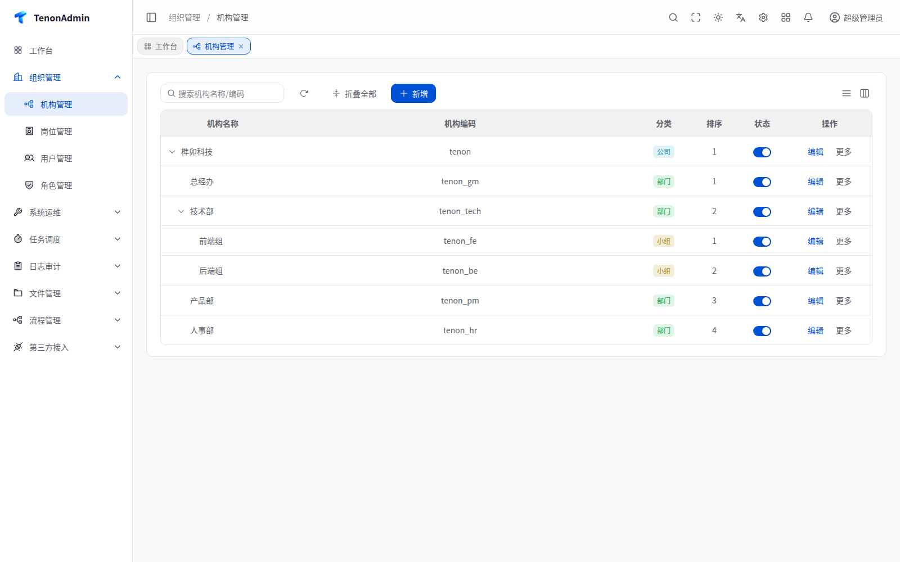</a><br>組織管理</td>
    <td width="50%" align="center"><a href="docs/screenshots/dictionary.png">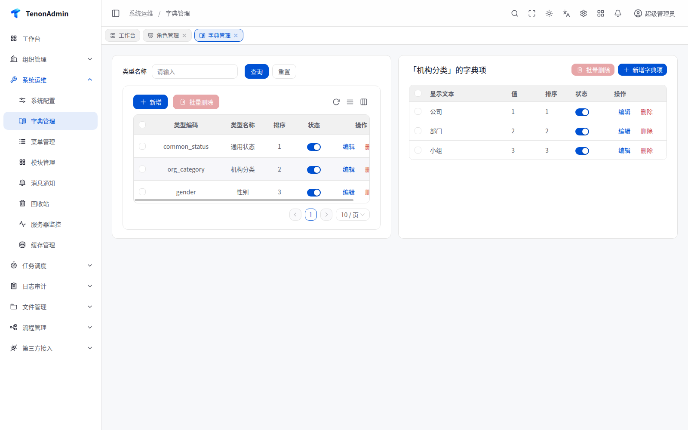</a><br>辞書管理</td>
  </tr>
  <tr>
    <td width="50%" align="center"><a href="docs/screenshots/file-management.png">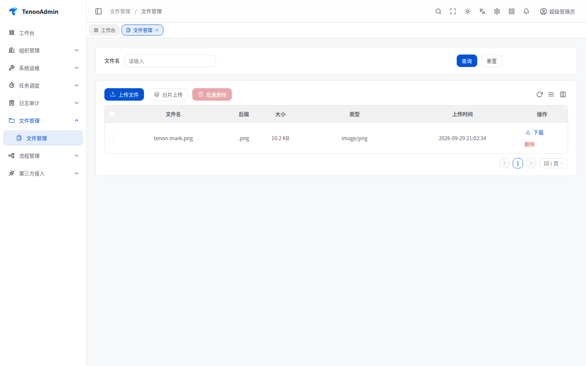</a><br>ファイル管理</td>
    <td width="50%" align="center"><a href="docs/screenshots/scheduled-jobs.png">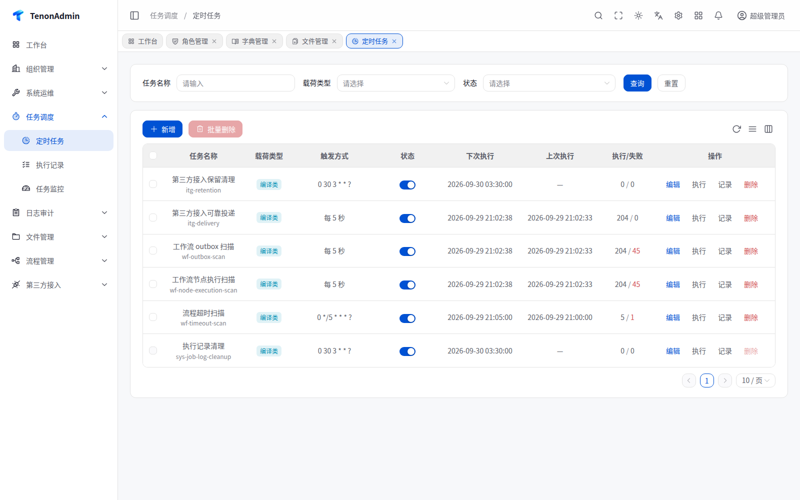</a><br>定期ジョブ</td>
  </tr>
  <tr>
    <td width="50%" align="center"><a href="docs/screenshots/workflow-pending.png">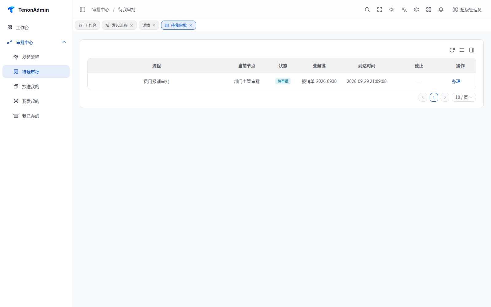</a><br>承認待ち</td>
    <td width="50%" align="center"><a href="docs/screenshots/delivery-tasks.png">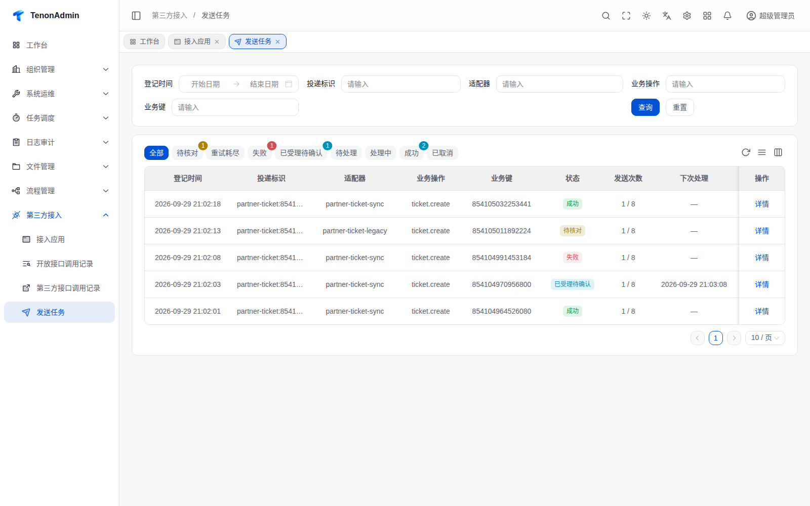</a><br>信頼性のある配信</td>
  </tr>
</table>

</details>

## オンラインデモとサンプルプロジェクト

[オンラインデモを開く](https://tenonadmin.52moyu.net/login) · [サンプルプロジェクトのソースコードを見る](https://github.com/Tenon-Net/tenon-example)

デモサイトは独立したアプリケーション `tenon-example` を使用しています。バックエンドは NuGet でフレームワークを導入し、フロントエンドは管理画面テンプレートを基に構成し、業務部分には CRM モジュールが含まれます。

ログイン画面に記載された業務アカウントで顧客一覧にアクセスすると、組織とデータ範囲がクエリ結果に与える影響を確認できます。サンプルの業務クエリと権限設定は[同じクエリ、3 つの数値](https://github.com/Tenon-Net/tenon-example/blob/dev/docs/showcase-multi-org-data-scope.md)を参照してください。

## リポジトリ構成

```text
TenonAdmin/
├── backend/                           # .NET バックエンド
│   ├── src/                           # NuGet パッケージのソースコード
│   │   ├── TenonAdmin/                # 導入点。ASP.NET Core 統合パッケージを参照
│   │   ├── TenonAdmin.Core/           # インターフェース、設定、結果、エラーコード
│   │   ├── TenonAdmin.SqlSugar/       # データアクセス、テーブル作成、グローバルフィルター
│   │   ├── TenonAdmin.Services/       # 管理エンティティ、業務サービス、シードデータ
│   │   ├── TenonAdmin.AspNetCore/     # 認証、コントローラー、ホスト統合
│   │   ├── TenonAdmin.Workflow/       # 承認ワークフロー
│   │   ├── TenonAdmin.Integration/    # 公開 API、外部呼び出し、信頼性のある配信
│   │   ├── TenonAdmin.Excel/          # Excel インポートとエクスポート
│   │   ├── TenonAdmin.Caching.Redis/  # Redis キャッシュ
│   │   └── TenonAdmin.Auth.*/         # GitHub、WeCom、DingTalk、WeChat ログイン
│   ├── samples/                       # サンプルホスト
│   │   ├── MinimalHost/               # 管理 API のサンプル
│   │   ├── WorkerHost/                # 独立したジョブプロセス
│   │   ├── IntegrationSample/         # システム連携のサンプル
│   │   └── IntegrationMockPartner/    # 連携サンプルの模擬接続先
│   ├── tests/                         # バックエンドテストとテストホスト
│   ├── Directory.Packages.props       # バックエンド依存関係のバージョン
│   └── TenonAdmin.slnx                # バックエンドソリューション
├── web/                               # Vue 3 + Naive UI 管理画面テンプレート
├── web-react/                         # React 19 + Ant Design 6 管理画面テンプレート
├── templates/                         # dotnet new プロジェクトテンプレート
├── skills/                            # AI 開発スキルと参照テンプレート
├── site/                              # ドキュメントサイト
├── docs/                              # アーキテクチャ、デプロイ、スクリーンショット、開発資料
├── scripts/                           # 契約チェック、テスト、検証スクリプト
├── .github/workflows/                 # CI とリリースワークフロー
├── docker-compose.yml                 # コンテナデプロイ設定
├── docker-compose.scale.yml           # 複数レプリカ構成の設定
└── LICENSE                            # Apache-2.0 ライセンス
```

`web/` と `web-react/` は、それぞれ依存関係とビルド設定を管理します。業務プロジェクトは NuGet でバックエンドパッケージを参照し、フロントエンドテンプレートの一方を開発の起点として使用します。

## ドキュメント

| 目的 | 参照先 |
| --- | --- |
| プロジェクトへの導入 | [導入ガイド](https://tenon.52moyu.net/guide/getting-started) |
| 業務機能の開発 | [開発スキルと参照テンプレート](skills/README.md) · [Vue コンポーネント](web/COMPONENTS.md) · [React コンポーネント](web-react/COMPONENTS.md) |
| サービスの差し替え | [サービスの差し替え](skills/replace-service.md) |
| 承認と外部システムの導入 | [承認ワークフロー](https://tenon.52moyu.net/guide/workflow) · [システム連携](https://tenon.52moyu.net/guide/integration) · [Excel インポートとエクスポート](skills/wire-import-export.md) |
| アーキテクチャの確認 | [アーキテクチャ](https://tenon.52moyu.net/backend/architecture) · [ランタイム構成図](docs/architecture/tenon-runtime.ja.architecture.html) |
| デプロイと更新 | [デプロイガイド](docs/deployment.md) · [更新履歴](CHANGELOG.md) |

## コントリビューション

開発ブランチは `dev` です。不具合は [GitHub Issues](https://github.com/Tenon-Net/TenonAdmin/issues) で報告し、コードの変更は `dev` 向けの PR として提出してください。

## 著作権とライセンス

Copyright © Tenon-Net

本プロジェクトは [Apache License 2.0](LICENSE) の下で、商用利用、変更、再配布ができます。

本プロジェクトまたは派生物を再配布する場合は、ライセンスの写しを添付し、変更したファイルに変更内容を明記し、配布するソースコードに該当する著作権、特許、商標、帰属表示を残してください。NOTICE ファイルの帰属表示を扱う場合は、ライセンス第 4 条に従ってください。

第三者のコンポーネントと素材には、それぞれのライセンスが適用されます。
