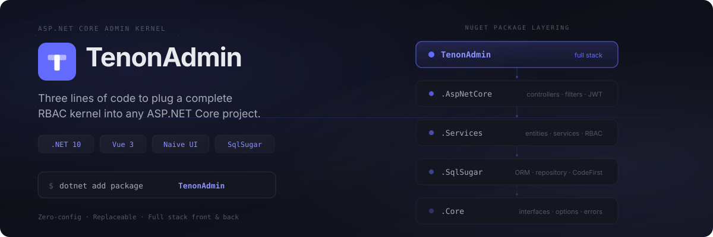
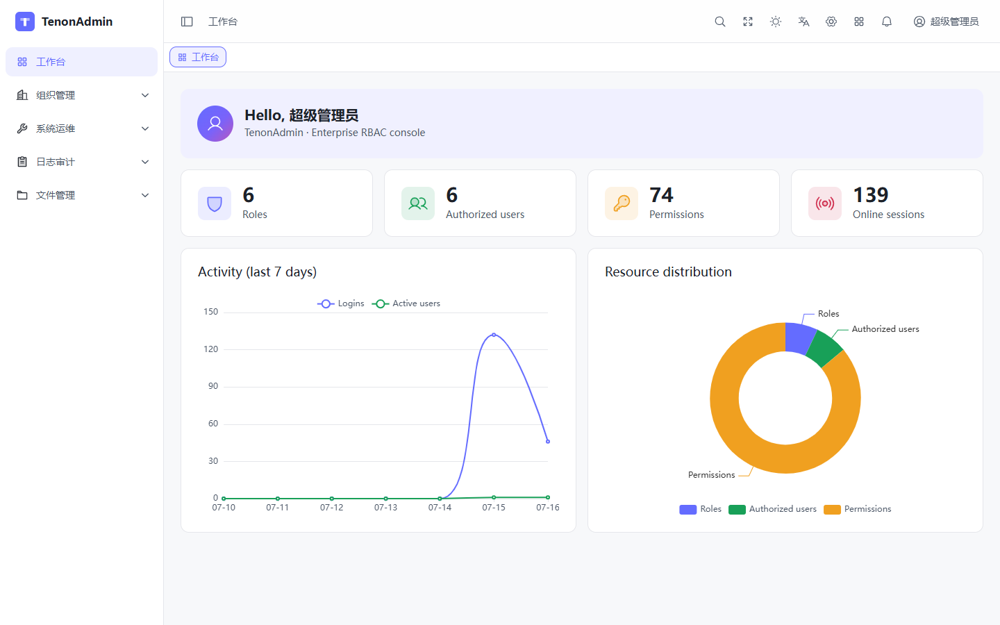
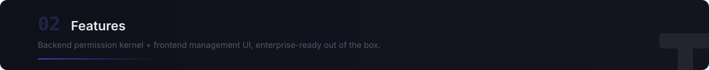

<!-- Keep in sync with README.zh-CN.md (canonical) -->

English | [简体中文](README.zh-CN.md) | [日本語](README.ja.md)

<p align="center">
  
</p>

<p align="center">
  <a href="LICENSE"></a>
  <a href="https://github.com/Tenon-Net/TenonAdmin/stargazers"></a>
  <a href="https://github.com/Tenon-Net/TenonAdmin/network/members"></a>
  <a href="https://www.nuget.org/packages/TenonAdmin"></a>
  
  <a href="https://github.com/Tenon-Net/TenonAdmin/actions"></a>
</p>

<p align="center">
  <a href="https://tenonadmin.52moyu.net/login"><strong>🔗 Live Demo</strong></a>&nbsp;&nbsp;·&nbsp;&nbsp;<a href="https://tenon.52moyu.net"><strong>📖 Docs</strong></a>&nbsp;&nbsp;·&nbsp;&nbsp;<a href="CHANGELOG.md"><strong>📋 Changelog</strong></a>
</p>

---

TenonAdmin is not a copy-and-customize admin template — it packages users, roles, menus, data permissions, logging and more into NuGet packages you plug into an existing project with three lines of code. Works out of the box, replaceable on demand.

<p align="center">
  
</p>

<p align="center">
  
</p>

Install the NuGet package:

```bash
dotnet add package TenonAdmin
```

Or run the sample project included in the repo:

```bash
dotnet run --project backend/samples/MinimalHost
```

On first startup it creates the database, seeds initial data, and prints a randomly generated super-admin password to the console.

Integrating into an existing project takes three lines:

```csharp
builder.Services.AddTenonAdmin(builder.Configuration);
var app = builder.Build();
app.MapTenonAdmin();
```

This registers JWT auth, RBAC, data permissions, and all management endpoints automatically.

<p align="center">
  
</p>

### Backend

- **Auth** — Account/password + captcha, JWT + refresh-token rotation, login lockout, online sessions & force-logout
- **RBAC** — Roles, three-level menus (directory / page / button), button-level permission codes, role-menu authorization
- **Data permissions** — All / this org / org & children / self only / custom orgs, auto-applied via ORM global filters
- **Multi-app portal** — App management, independent menu trees, app selection & switching
- **Organization** — Org tree, positions, multi-role users with a primary org
- **Notifications** — In-app notices & announcements, targetable to everyone / roles / users
- **Dictionary & config** — Dict types + items + key-value config, cached with event-driven invalidation
- **Logging** — Auto-recorded operation logs with sensitive-input masking
- **File management** — Upload/download, size limits, extension whitelist, path-traversal protection
- **Replaceable** — Services registered via `TryAdd` + interfaces + `virtual` steps — swap without forking
- **Multi-database** — SQLite (default) / MySQL / SQL Server / PostgreSQL
- **Multi-replica** — Optional Redis cache, cross-replica rate-limit counters, per-replica snowflake worker IDs

### Frontend

- **Contract-generated API** — OpenAPI → `schema.d.ts`, end-to-end type safety
- **Dynamic routing** — Backend menu tree drives route registration; multi-app portal with seamless switching
- **Button-level permissions** — `v-auth` directive gates buttons by route-based permission codes
- **ProTable (column-driven)** — One `columns` array drives search form, dict rendering, and column settings
- **Design-token system** — Four-layer CSS variable tokens, light/dark themes in parity (follows system / manual toggle)
- **i18n** — vue-i18n with runtime language switching
- **Three login-page skins** — Switchable out of the box, style-isolated
- **In-house component library** — FormContainer (modal/drawer two-in-one), StatusSwitch (pessimistic-update toggle), dict suite, OrgTreeSelect, FileUpload (chunked / resumable / instant), PasswordStrength, ECharts wrappers, and more

## Project Status

**The API may still change before 1.0** — breaking changes are called out in the [changelog](CHANGELOG.md). Development happens on the `dev` branch.

## License

[Apache License 2.0](LICENSE)
