<!-- 本文件与中文基准版 README.zh-CN.md 保持同步。 -->

English | [简体中文](README.zh-CN.md) | [日本語](README.ja.md)

<p align="center">
  
</p>

<h1 align="center">TenonAdmin</h1>

<p align="center"><strong>Three lines of code to add an admin framework to your ASP.NET Core project.</strong></p>

<p align="center">Install with NuGet · Keep business code in your application · Vue / React frontends</p>

<p align="center">
  <a href="https://www.nuget.org/packages/TenonAdmin"></a>
  
  
  
  
  
  
  
  <a href="https://github.com/Tenon-Net/TenonAdmin/actions/workflows/backend-ci.yml"></a>
  <a href="LICENSE"></a>
</p>

<p align="center">
  <a href="#quick-start">Quick start</a> ·
  <a href="#screenshots">Screenshots</a> ·
  <a href="https://tenonadmin.52moyu.net/login">Live demo</a> ·
  <a href="https://tenon.52moyu.net/">Documentation</a> ·
  <a href="CHANGELOG.md">Changelog</a>
</p>

## Introduction

TenonAdmin is an admin framework for ASP.NET Core. It provides common features such as users, roles, menus, organizations, and data permissions, with Vue and React admin interfaces. Use it to build internal business systems and operations dashboards, or add administration features to an existing .NET project.

Install `TenonAdmin` through NuGet, then add the core integration in `Program.cs`:

```csharp
builder.Services.AddTenonAdmin(builder.Configuration);
var app = builder.Build();
app.MapTenonAdmin();
```

The framework registers authentication, role permissions, data permissions, and administration APIs. It uses SQLite by default and creates the database, tables, and initial account on first startup, so there is no database server to set up first. See [Quick start](#quick-start) for the complete startup code and frontend commands.

Keep business entities, endpoints, and pages for customers, orders, and other modules in your own project. Extension interfaces let you customize login, file storage, and permission rules. Backend framework updates arrive through NuGet, while your business code stays separate from the framework source.

## Key features

### Build business features in your project and adapt the framework

When building a customer management module, reuse the existing accounts, roles, menus, and file management. Write customer entities, business endpoints, and admin pages in your application project. There is no need to put business code inside the framework source, and you can keep the application's existing business logic.

When a built-in implementation does not fit, such as when files need to go to object storage or login responses need extra business information, replace the relevant service or inherit the built-in service and override the step you need. Interfaces and overridable methods let you make that change without copying the entire implementation.

Backend fixes and new features are delivered as NuGet versions. Check the changelog when upgrading and adjust extensions and frontend API calls where needed. See [Service replacement and extension](skills/replace-service.md) for examples.

### Control actions and the records users can access

Role permissions determine which menus, buttons, and endpoints a user can access. Data permissions determine which business records they can query. The same customer list can show a department manager their department's data, give a higher-level manager access to subordinate departments, or allow selected organizations to work together.

Once a business entity follows the framework's data-scope conventions, supported queries apply filters based on the current user's roles. The customer query stays in the business service; the framework handles its data scope. Raw SQL and custom data-access paths need their own permission checks.

The independent example application uses a customer list to show how different accounts receive different records. See the [multi-organization data permissions example](https://github.com/Tenon-Net/tenon-example/blob/dev/docs/showcase-multi-org-data-scope.md).

### Choose Vue or React to suit your team

The Vue version uses Vue 3 and Naive UI. The React version uses React 19 and Ant Design 6. Both connect to the same backend APIs, so you only need one frontend for your business application.

New pages can reuse tables, forms, dictionary selectors, organization and user selectors, file uploads, and permission components. For example, filtering, pagination, an edit dialog, and button permissions on a customer list can follow existing pages and components rather than being rebuilt for each module.

API types can be generated from the backend's OpenAPI document and refreshed when endpoints change. Each frontend maintains its own dependencies and components. See the [Vue component documentation](web/COMPONENTS.md) and [React component documentation](web-react/COMPONENTS.md).

### Add approval workflows where your business needs them

Approval workflows are provided through an optional package. Use the process designer to set approvers, conditional branches, parallel branches, and carbon copies, and control which form fields can be viewed or edited at each step. Once a process is published, users can submit requests, handle pending approvals, and view progress and approval records.

The approval interface supports return, withdrawal, transfer, delegation, and adding or removing approvers. Process administrators can inspect runtime status, timeouts, and retry records. Vue and React both provide workflow interfaces against the same backend APIs.

Install and register `TenonAdmin.Workflow` at the same version as `TenonAdmin`. AI evaluation records results for reference; it does not automatically approve, reject, or advance a workflow. See the [workflow documentation](https://tenon.52moyu.net/guide/workflow) for integration and configuration.

### Give AI coding assistants the project's development conventions

The repository includes development Skills for modules, entities, endpoints, frontend pages, service extensions, and import/export. They contain implementation steps, reference code, and validation requirements. Ask your AI coding assistant to read the relevant instructions before writing code so it can follow the project's entity, service, permission, and component conventions.

For example:

> Follow `skills/new-module.md` to add a product management module with a name, code, category, and enabled status. Include category filtering, import/export, and menu and button permissions.

These Skills are development instructions and reference templates, not a standalone code generator. Review business rules, permissions, and test results after generation. Start with [Development Skills](skills/README.md).

## Quick start

The backend requires the .NET 10 SDK. Node.js 22.12 or later is recommended for the frontend. Run the repository sample for a first look, then follow the independent-project steps below when adding your own business features.

> Use a frontend template that matches the backend version, and keep extension packages at the same version as `TenonAdmin`. Read the [changelog](CHANGELOG.md) before upgrading.

### Run the complete sample

Clone the `dev` branch and start the backend:

```bash
git clone --branch dev --single-branch https://github.com/Tenon-Net/TenonAdmin.git
cd TenonAdmin
dotnet run --project backend/samples/MinimalHost
```

The backend runs at `http://localhost:5100`. The sample uses SQLite by default and creates its tables and the `superAdmin` account during initial setup.

The console prints the initial random password **only when the account is first created**. Save it for sign-in.

Open another terminal and start one frontend from the repository root.

**Vue:**

```bash
cd web
npm install
npm run dev
```

Open `http://localhost:5173` and sign in as `superAdmin` with the password from the console.

**React:**

```bash
cd web-react
npm install
npm run dev
```

Open `http://localhost:5174` and sign in with the same account. Choose either frontend; the backend only needs to run once. Change the initial password after signing in.

### Add TenonAdmin to your ASP.NET Core project

Install the backend package from your project directory:

```bash
dotnet add package TenonAdmin
```

A minimal `Program.cs` for a new host looks like this:

```csharp
using TenonAdmin.AspNetCore;

var builder = WebApplication.CreateBuilder(args);

// TenonAdmin 的核心接入
builder.Services.AddTenonAdmin(builder.Configuration);
var app = builder.Build();
app.MapTenonAdmin();

app.Run();
```

`AddTenonAdmin` registers framework services, and `MapTenonAdmin` adds the administration APIs. In an existing project, merge these two calls into your startup flow and keep your configuration, services, and business routes.

Use the matching Vue or React template for the admin interface. SQLite is the default database. To use MySQL, SQL Server, or PostgreSQL, set the database type and connection string in configuration.

See the [getting started guide](https://tenon.52moyu.net/guide/getting-started) for database settings, the project template, and integration with existing applications. Install Excel, external login, Redis, and workflow extensions as needed, then register and configure them according to their documentation.

## Feature overview

| Category | Main features |
| --- | --- |
| Users and organizations | Users, roles, organization tree, positions, online sessions, and forced sign-out |
| Permissions | Menu, button, and endpoint permissions; all data, current organization, current organization and descendants, current user, and selected organizations as data scopes |
| Login and security | Account and password, captcha, login lockout, and rate limiting; configurable multi-factor authentication, with SMS and external login integrations as needed |
| Administration | Multi-application portal, dictionaries, configuration, announcements, push messages, operation logs, and recycle bin |
| File management | Upload and download, signed access, chunked and resumable uploads, and instant upload for existing files |
| Excel import/export (optional package) | Import templates, data inspection, cell validation, duplicate detection, error reports, and export column selection |
| Scheduled jobs | Scheduled, fixed-interval, and one-time execution; code, HTTP, and SQL jobs, with logs, timeouts, retries, and failure alerts; SQL execution must be enabled in configuration |
| Approval workflows (optional package) | Process design, dynamic forms, field permissions per step, approval handling, timeout handling, and runtime records |
| Frontend support | Vue and React templates, Chinese and English, light and dark themes, layout settings, business components, and OpenAPI type generation |
| Data and deployment | SQLite, MySQL, SQL Server, PostgreSQL, multiple database connections, a standalone Worker, Docker, health checks, and a Redis cache extension |

See the [deployment guide](docs/deployment.md) for production configuration and multiple replicas. Sending workflow messages to external systems requires a real transport implementation; details are in the [workflow documentation](https://tenon.52moyu.net/guide/workflow).

## Screenshots

Click an image to view it at full size.

<!-- 每行两张，使用仓库中的等比缩略图；新增截图时继续追加 <tr>，并同步原图与缩略图。 -->
<table>
  <tr>
    <td width="50%" align="center" valign="top">
      <a href="docs/screenshots/vue-admin.png">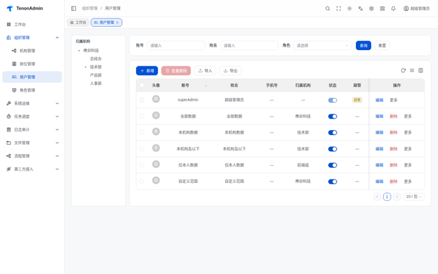</a>
      <br>Vue user management
    </td>
    <td width="50%" align="center" valign="top">
      <a href="docs/screenshots/react-admin.png">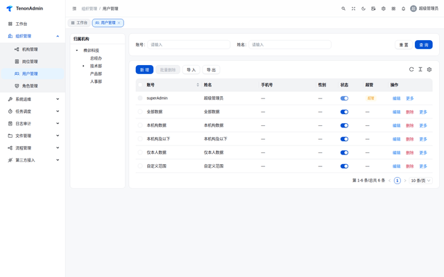</a>
      <br>React user management
    </td>
  </tr>
  <tr>
    <td width="50%" align="center" valign="top">
      <a href="docs/screenshots/role-permissions.png">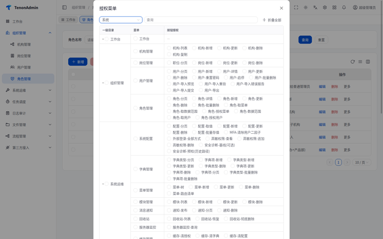</a>
      <br>Role permissions
    </td>
    <td width="50%" align="center" valign="top">
      <a href="docs/screenshots/org-management.png">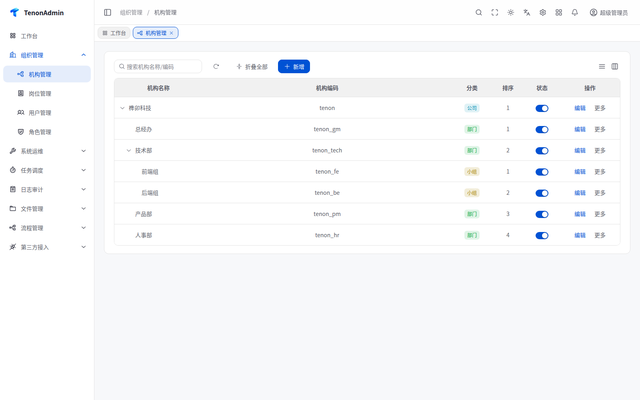</a>
      <br>Organization management
    </td>
  </tr>
  <tr>
    <td width="50%" align="center" valign="top">
      <a href="docs/screenshots/dictionary.png">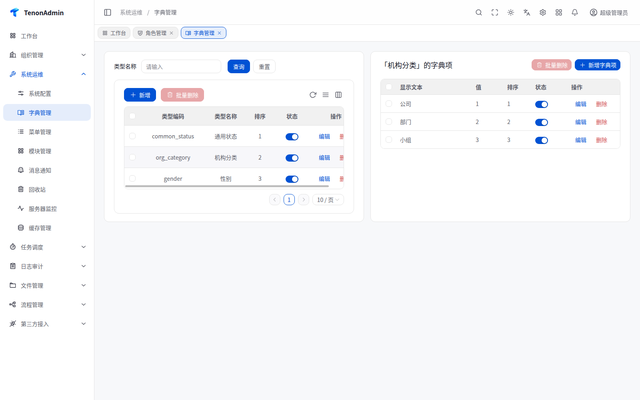</a>
      <br>Dictionary management
    </td>
    <td width="50%" align="center" valign="top">
      <a href="docs/screenshots/file-management.png">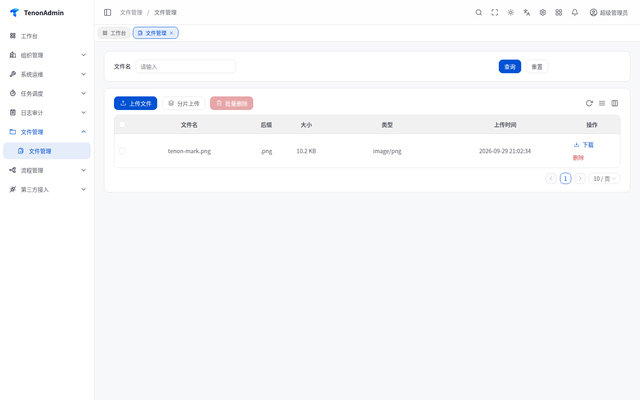</a>
      <br>File management
    </td>
  </tr>
  <tr>
    <td width="50%" align="center" valign="top">
      <a href="docs/screenshots/scheduled-jobs.png">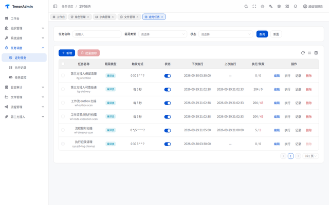</a>
      <br>Scheduled jobs
    </td>
    <td width="50%" align="center" valign="top">
      <a href="docs/screenshots/workflow-pending.png">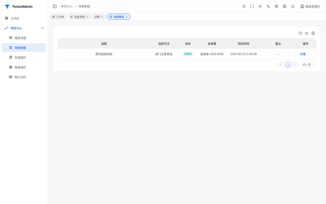</a>
      <br>Pending approvals
    </td>
  </tr>
  <tr>
    <td width="50%" align="center" valign="top">
      <a href="docs/screenshots/workflow-designer.png">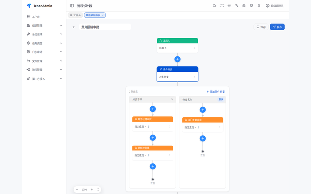</a>
      <br>Process designer
    </td>
    <td width="50%" align="center" valign="top">
      <a href="docs/screenshots/workflow-approval.png">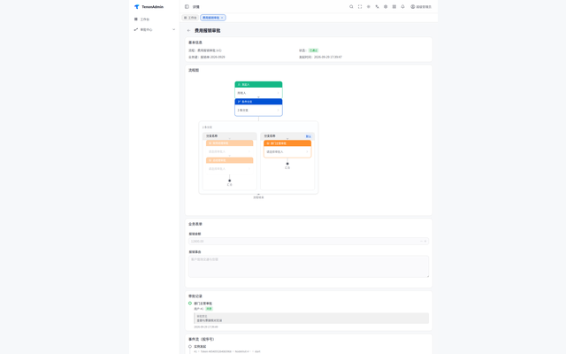</a>
      <br>Approval details
    </td>
  </tr>
  <tr>
    <td width="50%" align="center" valign="top">
      <a href="docs/screenshots/integration-apps.png">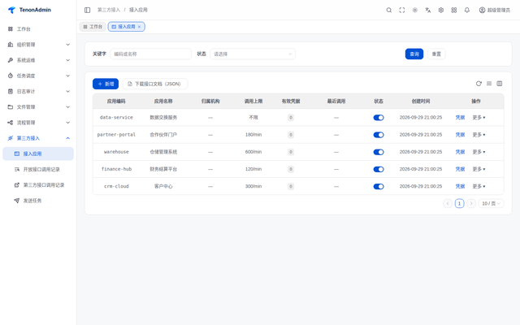</a>
      <br>Application integrations＊
    </td>
    <td width="50%" align="center" valign="top">
      <a href="docs/screenshots/delivery-tasks.png">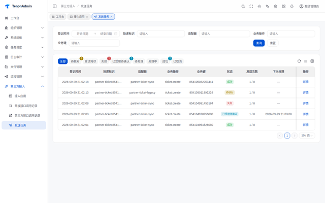</a>
      <br>Reliable delivery＊
    </td>
  </tr>
</table>

＊The application integration and reliable delivery screenshots are retained from the original README. Their implementations have not been confirmed in the `dev` snapshot used for this text; these two images do not indicate that the current branch includes system integration features.

## Documentation and business example

[tenon-example](https://github.com/Tenon-Net/tenon-example) is an independent business application. Its backend uses TenonAdmin through NuGet, its frontend is based on an admin template, and its business code includes a CRM module. Start here to see how to organize application code outside the framework.

The [live demo](https://tenonadmin.52moyu.net/login) is a separate deployment of that application and follows its version. Run the repository sample locally to try the current `dev` branch.

| Task | Documentation |
| --- | --- |
| Add the framework and configure a database | [Getting started](https://tenon.52moyu.net/guide/getting-started) |
| Add a business module | [Module development](skills/new-module.md) · [All development Skills](skills/README.md) |
| Build frontend pages | [Vue components](web/COMPONENTS.md) · [React components](web-react/COMPONENTS.md) |
| Customize built-in services | [Service replacement and extension](skills/replace-service.md) |
| Add import/export and approvals | [Excel import/export](skills/wire-import-export.md) · [Approval workflows](https://tenon.52moyu.net/guide/workflow) |
| Understand the backend structure | [Architecture](https://tenon.52moyu.net/backend/architecture) |
| Deploy and upgrade | [Deployment guide](docs/deployment.md) · [Changelog](CHANGELOG.md) |

<details>
<summary>Repository layout</summary>

```text
TenonAdmin/
├── backend/
│   ├── src/          Backend NuGet package source
│   ├── samples/      Sample hosts and standalone Worker
│   └── tests/        Backend tests
├── web/              Vue admin interface
├── web-react/        React admin interface
├── templates/        Backend project template
├── skills/           Development instructions and reference code
├── site/             Documentation site
└── docs/             Architecture, deployment, and development references
```

</details>

## Contributing

Development takes place on `dev`. Report problems through [Issues](https://github.com/Tenon-Net/TenonAdmin/issues), including the version, steps to reproduce, and relevant logs. Submit code changes as pull requests to `dev`.

## Copyright and license

Copyright © Tenon-Net

This project is licensed under the [Apache License 2.0](LICENSE), which permits commercial use, modification, and distribution.

When distributing this project or a derivative work, include a copy of the license, mark changed files, and retain applicable copyright, patent, trademark, and attribution notices in distributed source code. Follow Section 4 of the license for attribution notices from a NOTICE file.

Third-party components and assets remain subject to their respective licenses.
