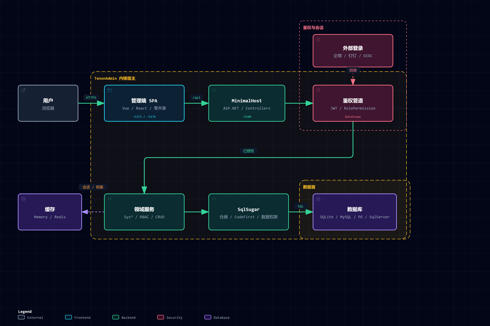

<!-- 本文件为 README 的中文基准版；README.md、README.ja.md 以本文件为准同步 -->

[English](README.md) | 简体中文 | [日本語](README.ja.md)

<p align="center">
  
</p>

<h1 align="center">TenonAdmin</h1>

<p align="center">
  <em>三行代码为您的 ASP.NET Core 项目添加完整、可扩展的 RBAC 访问管理层。</em>
</p>

<p align="center">
  <a href="LICENSE"></a>
  <a href="https://github.com/Tenon-Net/TenonAdmin/stargazers"></a>
  <a href="https://github.com/Tenon-Net/TenonAdmin/network/members"></a>
  <a href="https://www.nuget.org/packages/TenonAdmin"></a>
  
  <a href="https://github.com/Tenon-Net/TenonAdmin/actions"></a>
</p>

<p align="center">
  <a href="https://tenonadmin.52moyu.net/login"><strong>🔗 在线演示</strong></a>&nbsp;&nbsp;·&nbsp;&nbsp;<a href="https://tenon.52moyu.net/zh/"><strong>📖 文档</strong></a>&nbsp;&nbsp;·&nbsp;&nbsp;<a href="CHANGELOG.md"><strong>📋 更新日志</strong></a>
</p>

---

## 🎨 这是什么？

TenonAdmin 将通用的后台管理功能封装为 NuGet 包。用户、角色、菜单、多组织数据权限、字典、配置、操作日志、文件上传——这些每个后台系统都要重新开发的功能——通过 `dotnet add package` 即可引入。在 `Program.cs` 中只需三行代码，就能获得完整的管理 API：

```csharp
builder.Services.AddTenonAdmin(builder.Configuration);
var app = builder.Build();
app.MapTenonAdmin();
```

- **零配置启动**——首次运行自动建表、加载种子数据、默认使用 SQLite，甚至不需要数据库服务器
- **不满意就替换**——所有内置服务都基于接口实现，使用 `TryAdd` 注册。你的实现优先，内置实现自动让道，无需 fork 代码
- **升级等于更新包版本**——bug 修复和新功能通过包更新获取，业务代码无需迁移

传统做法是克隆模板仓库：几百个文件变成你的，维护成本高，业务代码和框架代码混在一起，框架更新时只能手动合并 diff。TenonAdmin 反其道而行——通用功能是包依赖，业务代码始终是业务代码。

前端也有配套方案：**两套功能等价的模板**（Vue 和 React），选择你熟悉的技术栈作为项目起点。

## 🗺️ 运行时架构

一次请求从浏览器到数据库的主路径：双前端模板 → Host → 鉴权与数据权限管道 → 领域服务 → SqlSugar → DB。

<p align="center">
  <a href="docs/architecture/tenon-runtime.zh-CN.architecture.html">
    
  </a>
</p>

<p align="center">
  <a href="docs/architecture/tenon-runtime.zh-CN.architecture.html"><strong>打开可交互架构图</strong></a>
  · 源 JSON：<a href="docs/architecture/tenon-runtime.zh-CN.architecture.json"><code>tenon-runtime.zh-CN.architecture.json</code></a>
</p>

## 🔭 想先看成品？

[在线演示](https://tenonadmin.52moyu.net/login)跑的不是内核自带的样例宿主，是一个独立的消费者应用 **[tenon-example](https://github.com/Tenon-Net/tenon-example)**：它从 NuGet 装包、`degit` 拿前端模板、写了一个 CRM 业务模块，然后部署上线。源码全开，你接入之后写出来的东西就长那样。

登录页有四个一键登录按钮。其中三个业务账号打开同一张客户列表，分别看到 214、128、42 条，而查询它的 `CustomerService` 里没有一行机构过滤——那是数据权限的全局过滤器在业务代码之外挂上去的。[《同一个查询，三个数字》](https://github.com/Tenon-Net/tenon-example/blob/dev/docs/showcase-multi-org-data-scope.md)讲了它挂在哪。

## 🚀 快速开始

### 环境要求

- .NET 10 SDK
- Node.js 20+（仅在运行前端模板时需要）

### 先跑起来看看

克隆仓库后，一行命令启动后端：

```bash
dotnet run --project backend/samples/MinimalHost
```

首次启动会自动创建数据库和表，加载种子数据，并在控制台打印随机生成的超级管理员密码（账号 `superAdmin`）。API 启动在 http://localhost:5100。

选择一套前端（也可以同时运行，互不冲突）：

```bash
cd web && npm install && npm run dev            # Vue → http://localhost:5173
cd web-react && npm install && npm run dev      # React → http://localhost:5174
```

打开浏览器，使用控制台显示的凭证登录，即可拥有完整的后台管理界面。在 Windows 上更简单：双击仓库根目录的 `dev.bat`，后端和两个前端会一键启动。

### 接进你自己的项目

```bash
dotnet add package TenonAdmin
```

将上面的三行代码加入 `Program.cs`，JWT 认证、RBAC、数据权限、所有管理端点都会自动注册。更换数据库只需配置：

```jsonc
// appsettings.json
"TenonAdmin": {
  "Database": {
    "DbType": "MySql",          // Sqlite / MySql / SqlServer / PostgreSQL
    "ConnectionString": "..."
  }
}
```

### 内置实现不想用？换掉它

所有内置服务都基于接口实现，使用 `TryAdd` 注册——先注册你的实现，内置的自动让道：

```csharp
// 例如替换密码哈希算法：先注册你的实现
builder.Services.AddSingleton<IPasswordHasher, MyPasswordHasher>();
builder.Services.AddTenonAdmin(builder.Configuration);
```

还能更细粒度：长方法拆分为多个 `virtual` 步骤，可以子类化内置服务并只覆盖关心的那一步，而非复制整个方法。这种可替换性不是口号——有专门的契约测试保障。

## ✨ 后端功能

- **认证**——账号密码 + 验证码，JWT + 刷新令牌轮换，登录锁定，在线会话与强制下线
- **RBAC**——角色、三级菜单（目录/页面/按钮）、按钮级权限码、角色菜单授权
- **数据权限**——全部/本组织/本组织及子级/仅本人/自定义组织，通过 ORM 全局过滤器强制，业务层零过滤代码
- **多应用门户**——应用管理、独立菜单树、应用切换
- **组织架构**——组织树、岗位、用户多角色加主机构
- **通知公告**——站内通知与公告，支持全员/角色/用户定向
- **字典与配置**——字典类型+项+键值配置，事件驱动失效缓存
- **日志**——操作日志自动记录，敏感输入脱敏
- **文件管理**——上传下载、尺寸限制、扩展名白名单、防路径穿越
- **多数据库**——SQLite（默认）/MySQL/SQL Server/PostgreSQL，配置切换
- **多副本**——可选 Redis 缓存、跨副本限流计数器、副本级雪花 Worker ID，横向扩展无忧
- **依赖克制**——核心包运行时仅依赖 SqlSugarCore 和 Microsoft.*，不向你的项目倾倒第三方框架

## 🖥️ 前端：两套官方模板，任选其一

同一套后端契约配有两套独立前端模板，选择你熟悉的栈：

| | `web/` | `web-react/` |
|---|---|---|
| 框架 | Vue 3 + Naive UI | React 19 + Ant Design 6 |
| 状态/路由 | Pinia + vue-router | zustand + react-router |
| 国际化 | vue-i18n | react-i18next |
| 开发端口 | :5173 | :5174 |

零共享是刻意的：两套模板从不相互引用，连工具函数都不共享。选一套就只带那套的依赖，删除另一套也不会有任何影响。功能逐页移植，两端都有：

- **契约生成 API**——OpenAPI → `schema.d.ts`，端到端类型安全；改端点前端编译失败
- **动态路由**——后端菜单树驱动路由注册，多应用门户无缝切换
- **按钮级权限**——Vue 的 `v-auth` 指令，React 的 `<Can>` 组件，权限码一致
- **列驱动表格**——一个 `columns` 数组驱动搜索表单、字典渲染、列设置
- **设计令牌 + 明暗主题**——四层 CSS 变量令牌，跟随系统或手动切换
- **三套登录页皮肤**——可切换、样式隔离
- **自研组件库**——FormContainer（模态框/抽屉二合一）、StatusSwitch（悲观更新切换）、字典组件集、OrgTreeSelect、FileUpload（分片/可恢复/秒传）、PasswordStrength、图表封装等——每套模板各实现一次

## 🧩 仓库结构

| 目录 | 说明 |
|---|---|
| `backend/` | .NET 10 核心（5 个 NuGet 包）+ 样例宿主 + 测试 |
| `web/` | Vue 3 + Naive UI 前端模板，独立运行 |
| `web-react/` | React 19 + Ant Design 6 前端模板，独立运行 |
| `templates/` | `dotnet new tenon-app` 项目模板 |
| `site/` | 文档站源码（VitePress，中英） |
| `docs/` | 设计文档与开发记录 |

## 📋 项目状态

**1.0 之前 API 可能会变动**——破坏性变更在[更新日志](CHANGELOG.md)中标注。开发在 `dev` 分支进行，欢迎 issue 和 PR。

## 📄 许可证

[Apache License 2.0](LICENSE)
