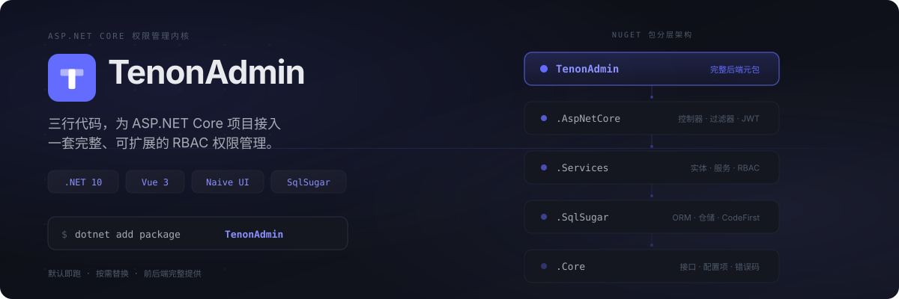

<!-- 本文件为 README 的中文基准版；README.md、README.ja.md 以本文件为准同步 -->

[English](README.md) | 简体中文 | [日本語](README.ja.md)

<p align="center">
  
</p>

<p align="center">
  <a href="LICENSE"></a>
  <a href="https://github.com/Tenon-Net/TenonAdmin/stargazers"></a>
  <a href="https://github.com/Tenon-Net/TenonAdmin/network/members"></a>
  <a href="https://www.nuget.org/packages/TenonAdmin"></a>
  
  <a href="https://github.com/Tenon-Net/TenonAdmin/actions"></a>
</p>

<p align="center">
  <a href="https://tenonadmin.52moyu.net/login"><strong>🔗 在线预览</strong></a>&nbsp;&nbsp;·&nbsp;&nbsp;<a href="https://tenon.52moyu.net/zh/"><strong>📖 文档</strong></a>&nbsp;&nbsp;·&nbsp;&nbsp;<a href="CHANGELOG.md"><strong>📋 更新日志</strong></a>
</p>

---

TenonAdmin 不是一套需要复制再二开的后台模板——它把用户、角色、菜单、数据权限、日志等通用能力封装成 NuGet 包，三行代码接入已有项目，默认即跑，按需替换。

<p align="center">
  
</p>

安装 NuGet 包：

```bash
dotnet add package TenonAdmin
```

或者直接运行仓库自带的示例项目：

```bash
dotnet run --project backend/samples/MinimalHost
```

首次启动自动建表、初始化数据，超级管理员密码随机生成并输出到控制台。

接入已有项目只需三行：

```csharp
builder.Services.AddTenonAdmin(builder.Configuration);
var app = builder.Build();
app.MapTenonAdmin();
```

启动后自动注册 JWT 认证、RBAC 权限、数据权限及全部管理端接口。

<p align="center">
  
</p>

### 后端

- **认证** — 账号密码 + 图形验证码、JWT + Refresh Token 轮换、登录锁定、在线会话与强制退出
- **RBAC** — 角色管理、目录／页面／按钮三级菜单、按钮级权限码、角色菜单授权
- **数据权限** — 全部 / 本机构 / 本机构及下级 / 仅本人 / 自定义，ORM 全局过滤器自动生效
- **多应用门户** — 应用管理、独立菜单树、应用选择与切换
- **组织机构** — 机构树、职位、用户多角色与主属机构
- **消息通知** — 站内通知与公告，可按全体 / 角色 / 用户发送
- **字典与配置** — 字典类型 + 字典项 + 键值配置，缓存 + 事件驱动失效
- **日志** — 操作日志自动记录、敏感输入脱敏
- **文件管理** — 上传下载、大小限制、扩展名白名单、路径穿越防护
- **可替换** — 主要服务 `TryAdd` + 接口注册 + 关键步骤 `virtual`，不 fork 即可替换
- **多数据库** — SQLite（默认）/ MySQL / SQL Server / PostgreSQL
- **多副本** — 可选 Redis 缓存、跨副本限流计数、每副本独立雪花机器号

### 前端

- **合约生成 API** — OpenAPI → `schema.d.ts`，全链路类型安全
- **动态路由** — 后端菜单树驱动路由注册，多应用门户无缝切换
- **按钮级权限** — `v-auth` 指令，按路由权限码控制按钮显隐
- **ProTable 列驱动** — 一个 `columns` 数组同时驱动搜索表单、字典渲染与列设置
- **设计令牌体系** — CSS 变量四层令牌，亮暗双主题对等（跟随系统 / 手动切换）
- **i18n 多语言** — vue-i18n，运行时切换
- **三套登录页皮肤** — 开箱可选，样式隔离
- **自研组件库** — FormContainer（弹窗/抽屉二合一）、StatusSwitch（悲观更新开关）、字典三件套、OrgTreeSelect、FileUpload（分片/断点续传/秒传）、PasswordStrength、ECharts 封装等

## 项目状态

**1.0 之前 API 仍可能调整**，破坏性变更会在[更新日志](CHANGELOG.md)中标出。开发在 `dev` 分支进行。

## 许可证

[Apache License 2.0](LICENSE)
